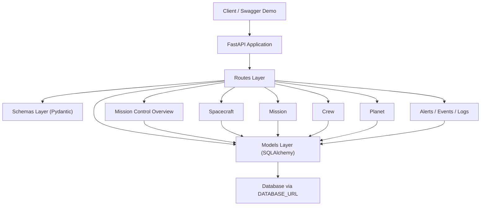
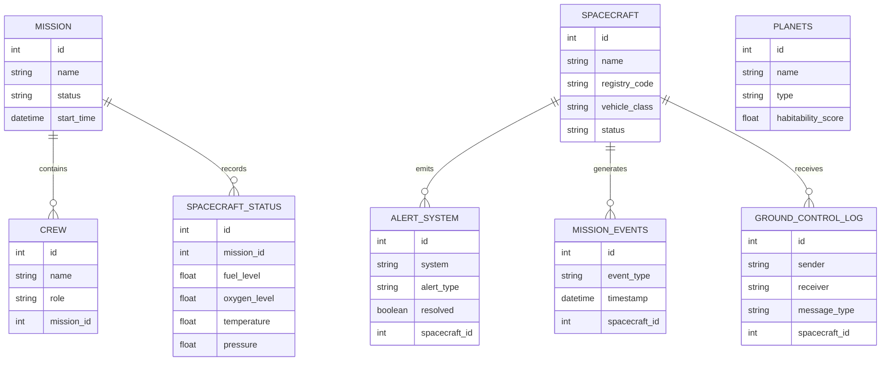

# Endurance Mission Control

Backend de mission control para uma nave de exploração interestelar inspirado na linguagem operacional de *Interstellar*.

O objetivo deste projeto é simular um sistema de controle de missão com foco em subsistemas críticos, telemetria, navegação, alertas, comunicação com ground control e visão consolidada do estado da missão. Ele foi pensado como peça de portfólio para demonstrar modelagem de domínio, organização de backend e capacidade de construir software com linguagem próxima de operações aeroespaciais.

## What This Project Demonstrates

- modelagem de sistemas críticos com `FastAPI`, `SQLAlchemy` e `Pydantic`
- organização modular por domínio: `models`, `schemas` e `routes`
- backend orientado a operações de missão, não apenas CRUD genérico
- narrativa técnica inspirada em exploração deep-space
- base pronta para evoluir para dashboard, documentação visual e deploy

## Mission Scenario

O projeto apresenta a nave `Endurance` em uma missão de exploração e coordenação deep-space. A demo atual usa um cenário com:

- nave `Endurance`
- missão `Lazarus Relay Expedition`
- corpos de referência como `Miller`, `Mann` e `Edmunds`
- eventos orbitais próximos de `Gargantua`
- alertas operacionais, status da nave e logs de ground control

Isso ajuda o projeto a sair de uma API abstrata e virar uma demonstração com contexto, história operacional e identidade própria.

## Current Capabilities

### Core domains

- `Spacecraft`: catálogo de veículos, perfil de missão e status operacional
- `Mission`: ciclo de missão e contexto principal
- `Crew`: tripulação e papéis
- `Planet`: destinos e corpos celestes monitorados
- `Spacecraft Status`: snapshot de combustível, oxigênio, temperatura e pressão
- `Mission Events`: eventos de missão como engine burns e orbital insertion
- `Alert System`: alertas por criticidade e subsistema
- `Ground Control Log`: mensagens entre controle de missão e nave

### Subsystems and support modules

- fuel
- power
- thermal control
- communication
- navigation
- telemetry
- abort and recovery
- docking
- payload
- environment monitor
- resource management
- software update log
- subsystem diagnostics

### Portfolio-focused endpoints

- `GET /`
  Retorna metadados básicos da API
- `GET /health`
  Confirma que a aplicação está operacional
- `POST /demo/bootstrap`
  Cria um dataset demo coerente para apresentação
- `GET /mission-control/overview`
  Retorna uma visão executiva da missão com métricas, snapshot e alertas ativos

## Tech Stack

- `FastAPI`
- `SQLAlchemy 2`
- `Alembic`
- `Pydantic 2`
- `Uvicorn`
- `python-dotenv`
- `SQLite` como fallback local
- compatível com `DATABASE_URL` para futura migração de banco

## Architecture Overview



## Domain Model



## Design Decisions

- `Domain-first structure`
  Cada módulo segue a separação `models` + `schemas` + `routes`, o que ajuda a manter clareza entre persistência, contrato da API e comportamento HTTP.
- `Operational narrative over generic CRUD`
  O projeto foi desenhado para parecer um sistema de missão real, então os módulos e dados demo seguem linguagem operacional e contexto de missão.
- `Portfolio-ready demo endpoint`
  O endpoint `POST /demo/bootstrap` reduz atrito para demonstração e permite mostrar valor rapidamente em entrevista.
- `Mission overview aggregation`
  O endpoint `GET /mission-control/overview` existe para mostrar pensamento de sistema e observabilidade, não apenas CRUD isolado.
- `Database portability`
  O projeto usa `DATABASE_URL`, com `SQLite` local como fallback, preparando terreno para migração futura para PostgreSQL.
- `Schema evolution with Alembic`
  O schema do banco agora pode ser recriado por migrations versionadas, o que deixa o projeto mais reproduzível e profissional para portfólio.

## Project Structure

```text
alembic/
├── env.py
└── versions/

app/
├── main.py
├── config.py
├── database.py
├── models/
├── routes/
├── services/
└── schemas/

tests/
└── test_mission_control_smoke.py
```

## Running Locally

### 1. Activate the virtual environment

```bash
source /Users/mariaizabelvieirapassos/Desktop/endurance_mission/venv/bin/activate
```

### 2. Go to the project folder

```bash
cd /Users/mariaizabelvieirapassos/Desktop/endurance_mission/endurance_mission
```

### 3. Install dependencies if needed

```bash
pip install -r requirements.txt
```

### 4. Create a local environment file

```bash
cp .env.example .env
```

### 5. Create the database schema with Alembic

```bash
AUTO_CREATE_TABLES=false alembic upgrade head
```

### 6. Start the API

```bash
DATABASE_URL=sqlite:///./test.db AUTO_CREATE_TABLES=false uvicorn app.main:app --reload
```

### 7. Open the docs

- [http://127.0.0.1:8000/docs](http://127.0.0.1:8000/docs)
- [http://127.0.0.1:8000/redoc](http://127.0.0.1:8000/redoc)

## Database Migrations

O projeto usa `Alembic` para versionar a evolução do schema do banco.

Comandos principais:

```bash
alembic upgrade head
alembic revision --autogenerate -m "describe change"
```

Variáveis úteis:

- `DATABASE_URL`
  Define o banco-alvo da aplicação e das migrations.
- `AUTO_CREATE_TABLES`
  Quando `false`, a aplicação não usa `Base.metadata.create_all()` e espera que o schema já tenha sido criado via Alembic.

Para fluxo de portfólio, o recomendado é usar:

```bash
DATABASE_URL=sqlite:///./test.db
AUTO_CREATE_TABLES=false
```

O endpoint raiz `/` também expõe o modo atual de schema management, o que ajuda a inspecionar rapidamente se a aplicação está rodando com o fluxo esperado.

## Demo Flow For Recruiters

Se você quiser apresentar este projeto em 2-3 minutos, o fluxo recomendado é:

1. abrir `/docs`
2. executar `POST /demo/bootstrap`
3. abrir `GET /mission-control/overview`
4. mostrar os módulos de `spacecraft`, `missions`, `alerts`, `mission-events` e `ground-control-log`
5. explicar como a API foi organizada para representar operações de missão e monitoramento de subsistemas

## Suggested Interview Pitch

Se você precisar explicar rapidamente o projeto em uma entrevista, uma boa versão curta seria:

> "Endurance Mission Control is a FastAPI backend that simulates a deep-space mission control environment inspired by Interstellar. I built it to model spacecraft operations, crew, telemetry, alerts, mission events and ground-control communication in a way that feels closer to an operational aerospace system than a generic CRUD app. I also added a mission overview layer and a demo bootstrap flow so the project is easy to explore and present."

## Smoke Tests

O projeto já possui um teste de fumaça para validar boot da aplicação e fluxo básico da demo:

```bash
python -m unittest tests/test_mission_control_smoke.py
```

Também existe cobertura para o fluxo com Alembic, garantindo que o schema pode nascer por migration sem depender de `create_all()`.

## Why This Is A Strong Portfolio Project

Este projeto comunica competências importantes para vagas técnicas:

- design de backend modular
- modelagem de domínio com entidades relacionadas
- atenção a observabilidade e estado operacional
- capacidade de traduzir um conceito complexo em um sistema navegável
- preocupação com demonstração, documentação e apresentação técnica

Ele também mostra algo importante para o setor aeroespacial: não apenas código, mas pensamento de sistema.

## Next Planned Improvements

- padronização de respostas e tratamento de erro nas rotas mais antigas
- ampliação dos testes para fluxos de CRUD e overview
- dashboard visual para mission control
- preparação para deploy
- documentação técnica em inglês voltada a recrutadores

## Author

Maria Izabel Vieira Passos  
GitHub: [@belvpassos](https://github.com/belvpassos)

## License

© 2025 Maria Izabel Vieira Passos. All rights reserved.
