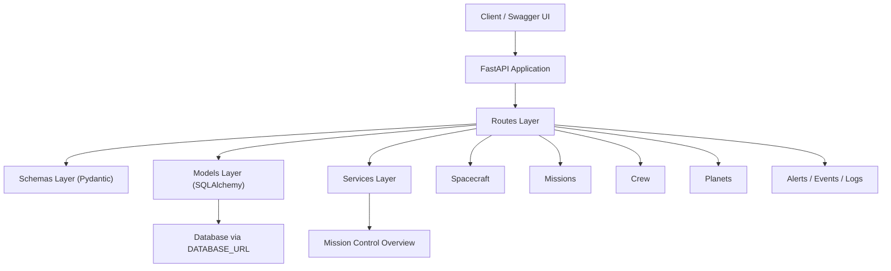
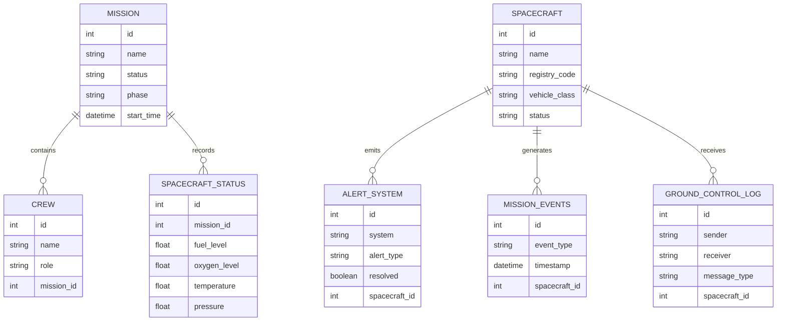

# Endurance Mission Control

FastAPI backend for a deep-space mission control simulation focused on spacecraft operations, telemetry, subsystem monitoring, alerts, navigation, crew coordination, and ground-control communication.

This project is part of my software engineering portfolio and is designed to show backend domain modeling, API organization, database migrations, and aerospace-inspired system thinking.

## What This Project Demonstrates

- Domain-first backend architecture with `FastAPI`, `SQLAlchemy`, and `Pydantic`
- Modular API structure across `models`, `schemas`, `routes`, and `services`
- Mission-control concepts beyond generic CRUD endpoints
- Demo data that creates a coherent operational scenario
- Database schema management with `Alembic`
- Smoke tests for application boot, migrations, mission overview, and demo data

## Mission Scenario

The current demo models the spacecraft `Endurance` during a deep-space mission scenario inspired by the operational language of mission control systems.

The demo includes:

- Spacecraft and mission records
- Crew roles
- Celestial body references
- Mission events
- Operational alerts
- Spacecraft status snapshots
- Ground-control logs
- Aggregated mission-control overview

## Current Capabilities

### Core Domains

- `Spacecraft`: vehicle records, registry codes, vehicle class, and operational status
- `Mission`: mission lifecycle, current phase, and mission metadata
- `Crew`: crew manifest and mission roles
- `Planet`: destination and celestial body reference data
- `Spacecraft Status`: fuel, oxygen, temperature, pressure, and flight-stage snapshots
- `Mission Events`: mission timeline entries such as burns, insertion events, and surface operations
- `Alert System`: active and resolved alerts by subsystem and severity
- `Ground Control Log`: communication records between mission control and spacecraft

### Subsystems

- Fuel
- Power
- Thermal control
- Communication
- Navigation
- Telemetry
- Abort and recovery
- Docking
- Payload
- Environment monitoring
- Resource management
- Software update logs
- Subsystem diagnostics

### Portfolio-Focused Endpoints

```text
GET  /
GET  /health
POST /demo/bootstrap
GET  /mission-control/overview
```

The `POST /demo/bootstrap` endpoint creates a coherent demo dataset, and `GET /mission-control/overview` returns an executive-style mission snapshot with metrics, current status, recent events, and active alerts.

## Tech Stack

- Python
- FastAPI
- SQLAlchemy 2
- Pydantic 2
- Alembic
- Uvicorn
- python-dotenv
- SQLite for local development
- `DATABASE_URL` support for future PostgreSQL deployment
- React
- TypeScript
- Vite

## Architecture Overview



## Domain Model Snapshot



## Project Structure

```text
app/
├── main.py
├── config.py
├── database.py
├── models/
├── routes/
├── schemas/
└── services/

alembic/
├── env.py
└── versions/

tests/
└── test_mission_control_smoke.py

frontend/
├── src/
├── public/
├── package.json
└── vite.config.ts
```

## Running Locally

### 1. Clone the repository

```bash
git clone https://github.com/belvpassos/endurance_mission.git
cd endurance_mission
```

### 2. Create and activate a virtual environment

```bash
python -m venv .venv
source .venv/bin/activate
```

On Windows:

```bash
.venv\Scripts\activate
```

### 3. Install dependencies

```bash
pip install -r requirements.txt
```

Install the frontend dependencies in a separate terminal:

```bash
cd frontend
npm install
cd ..
```

### 4. Configure local environment variables

Create a `.env` file in the project root:

```env
DATABASE_URL=sqlite:///./test.db
AUTO_CREATE_TABLES=false
```

### 5. Run database migrations

```bash
alembic upgrade head
```

### 6. Start the API

```bash
uvicorn app.main:app --reload
```

Open the API docs:

- http://127.0.0.1:8000/docs
- http://127.0.0.1:8000/redoc

## Demo Flow

For a quick walkthrough:

1. Open `/docs`
2. Run `POST /demo/bootstrap`
3. Run `GET /mission-control/overview`
4. Explore spacecraft, missions, alerts, mission events, and ground-control logs

## Running Tests

```bash
python -m unittest tests/test_mission_control_smoke.py
```

The smoke tests validate:

- Application boot and core routes
- Alembic migration flow
- Demo dataset bootstrap
- Mission-control overview aggregation
- Basic mission CRUD behavior

## Design Decisions

### Domain-first structure

Each major domain is organized across `models`, `schemas`, and `routes` to keep persistence, API contracts, and HTTP behavior clear.

### Operational narrative over generic CRUD

The project is intentionally structured around mission operations, subsystem state, alerts, and telemetry concepts instead of only generic database records.

### Recruiter-friendly demo flow

The demo bootstrap and mission overview endpoints make the project easy to explore during interviews or portfolio reviews.

### Migration-based schema management

Alembic is used so the database schema can be recreated in a reproducible way without relying only on `create_all()`.

## Interview Pitch

Endurance Mission Control is a FastAPI backend that simulates a deep-space mission control environment. I built it to model spacecraft operations, crew, telemetry, alerts, mission events, and ground-control communication in a way that feels closer to an operational aerospace system than a generic CRUD app. The project includes a demo bootstrap flow, Alembic migrations, and smoke tests so it can be explored and presented quickly.

## Roadmap

- Add more route-level tests
- Standardize error handling across older routes
- Add richer telemetry simulation
- Prepare a React and TypeScript mission dashboard
- Add Docker support
- Prepare deployment
- Add screenshots or a short walkthrough video

## Disclaimer

This is an independent educational portfolio project. It is not affiliated with NASA, ESA, SpaceX, Docking Robotics, or any employer. It does not include proprietary code, designs, architecture, or confidential information.

## Author

Maria Izabel Vieira Passos  
GitHub: [@belvpassos](https://github.com/belvpassos)  
LinkedIn: [maria-izabel09](https://www.linkedin.com/in/maria-izabel09)
